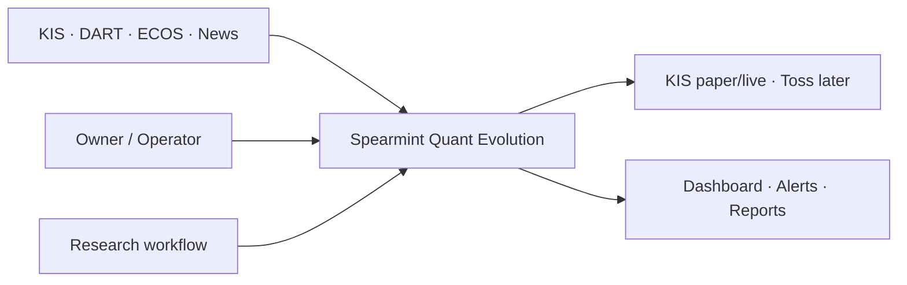
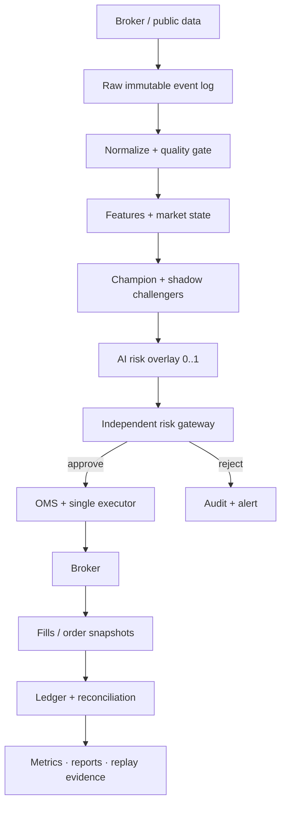
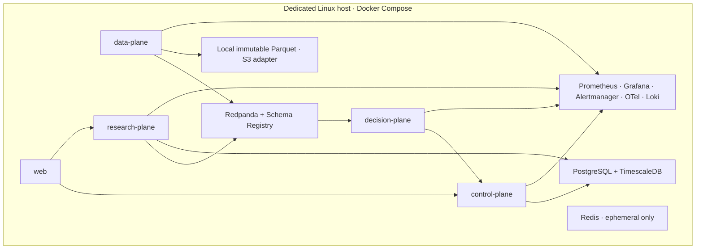

# 01. 아키텍처

## 1. 설계 원칙

1. **Log first:** 외부 입력은 변환 전에 기록한다.
2. **Event time first:** 시장에서 발생한 시간과 시스템이 알게 된 시간을 분리한다.
3. **Intent before side effect:** 전략은 의도를 만들고 control plane이 부작용을 수행한다.
4. **At-least-once + idempotency:** 외부 broker를 포함한 exactly-once를 가정하지 않는다.
5. **Single writer for orders:** 주문 제출 권한은 fenced active executor 한 곳에만 있다.
6. **Research/live parity:** signal package와 event contract를 연구·paper·live가 공유한다.
7. **Logical services, few deployables:** 코드 경계는 세밀하게, 초기 운영 경계는 작게 유지한다.
8. **Fail safe:** 불명확할 때 포지션 확대보다 정지를 선택한다.

## 2. 시스템 컨텍스트



외부 데이터는 신뢰하지 않는 입력이다. 모든 source adapter가 rate limit, 시각, sequence, schema, 라이선스 metadata를 canonical boundary로 변환한다.

## 3. 핵심 거래 흐름



### 핵심 해석

- Raw log는 audit의 시작점이며 canonical event와 분리한다.
- Strategy 결과는 broker order가 아니라 `OrderIntent`다.
- AI는 intent 이전에 노출 배수를 줄이기만 한다.
- Risk 승인 후에도 executor가 idempotency·fencing·broker state를 검사한다.
- Broker 응답은 권위 있는 외부 사실이지만 내부 ledger와 반드시 대사한다.

## 4. 논리 컴포넌트

| 컴포넌트 | 책임 | 금지 |
| --- | --- | --- |
| Market gateway | KIS WS/REST, reconnect, snapshot/delta, raw publish | feature·signal 계산 |
| Disclosure/event gateway | DART/ECOS/GDELT 수집, source metadata | 원문 권리 무시, 주문 |
| Normalizer | canonical schema, dedupe, quality, dead-letter | 임의 최신값 보정 |
| Feature engine | bars, indicators, market regime, bitemporal lookup | broker 접근 |
| Strategy runtime | deterministic signal, target exposure, intent | credential·order API 접근 |
| AI overlay | event class/risk flags/multiplier/expiry | exposure 증가·주문·승격 |
| Risk engine | hard limits, freshness, loss, cash/position, averaging-down rule | 전략별 임의 우회 |
| OMS | intent→order command, state transitions, cancel/replace | 맹목 재시도 |
| Executor | fenced single writer, broker adapter 호출 | 두 active writer |
| Ledger | immutable orders/fills/cash/positions derivation | 로그를 권위 장부로 대체 |
| Reconciler | broker snapshot 대조, mismatch resolution | 자동으로 불명확한 차이 은폐 |
| Research/validator | replay, backtest, CV, DSR/PBO, stress | 직접 champion 변경 |
| Promotion controller | evidence gate, approval, signed alias, rollback | 무승인 자본 배정 |
| Control API/UI | 관찰, 승인, kill switch, reports | frontend에서 broker 직접 호출 |

## 5. MVP 물리 배포 구조



### 배포 단위 내부 규칙

- 각 plane 내부는 모듈형 monolith로 구현할 수 있다.
- 다른 plane과의 결합은 Protobuf event 또는 명시적 API contract를 통해서만 한다.
- risk와 OMS는 같은 control-plane process에서 direct call로 시작할 수 있으나 인터페이스는 분리한다.
- broker executor는 control-plane 내부에서도 별도 worker/credential boundary를 가진다.
- Research plane은 live order topic/credential에 접근할 수 없다.

## 6. 통신 패턴

| 상황 | 패턴 | 이유 |
| --- | --- | --- |
| 시장·feature·signal·fill 상태 | Kafka-compatible events | replay, fan-out, audit |
| Decision→Risk | gRPC/Protobuf + deadline | typed synchronous decision |
| Control API→UI | REST + WebSocket/SSE | 명령과 실시간 상태 분리 |
| 배치 연구·백필 | Dagster jobs/assets | backfill, lineage, checks |
| LLM 호출 | async HTTP adapter + strict schema | hot path 격리 |
| DB side effect→event | transactional outbox | DB와 publish 불일치 방지 |
| Event→DB side effect | inbox/dedupe | at-least-once 중복 방지 |

## 7. 이벤트 시간과 정렬

모든 event envelope에 다음 시각을 둔다.

- `event_time`: 거래소/원천에서 사건이 발생한 시각
- `provider_time`: provider가 부여한 시각
- `ingested_at`: gateway가 받은 시각
- `available_at`: 전략이 합법적으로 사용할 수 있게 된 시각
- `processed_at`: 해당 consumer가 처리한 시각(필요 시)

정렬·partition 기준:

- market topics: `symbol`
- account order/risk/ledger topics: `account_id`
- strategy lifecycle: `strategy_id`
- 동일 key 내부 순서는 보장하되 서로 다른 key의 전체 순서는 가정하지 않는다.
- exchange sequence가 없으면 gateway-local monotonic sequence와 payload hash를 기록하되 거래소 순서를 완전히 복원했다고 주장하지 않는다.

Late event 처리:

1. configured lateness 이내면 state를 보정하되 기존 decision은 immutable하게 유지한다.
2. 보정 전/후 state와 영향 범위를 기록한다.
3. live order를 소급 변경하지 않는다.
4. 연구 replay에는 late-arrival 시나리오를 포함한다.

## 8. 주문의 실패 의미론

외부 REST 주문은 다음 이유로 exactly-once가 아니다.

- 요청을 broker가 받았지만 응답이 유실될 수 있다.
- client retry와 broker 내부 처리 순서가 다를 수 있다.
- broker가 client idempotency를 완전히 보장하지 않을 수 있다.

따라서:

1. DB에 `OrderIntent`와 outbox를 한 transaction으로 기록한다.
2. executor는 `client_order_id`와 fencing token을 확인한다.
3. 제출 전 동일 id/order snapshot을 조회할 수 있으면 조회한다.
4. timeout이면 상태를 `UNKNOWN`으로 바꾸고 신규 제출을 중지한다.
5. broker order history를 조회해 ACK/FILL/REJECT 여부를 확정한다.
6. 확정 전 동일 intent를 새 주문으로 재사용하지 않는다.

## 9. 리더십과 fencing

`active-passive` executor를 사용한다.

- DB 또는 별도 consensus에서 증가하는 `fencing_token`을 발급한다.
- order side effect는 현재 token을 가진 worker만 수행한다.
- `(account_id, client_order_id)` unique constraint가 최종 중복 방어선이다.
- heartbeat/lease는 liveness 힌트이며 단독 안전 보장이 아니다.
- 두 worker가 동시에 active로 관측되면 global entry kill switch를 건다.

Kubernetes로 이동해도 Lease만으로 외부 broker 주문 중복을 해결했다고 간주하지 않는다.

## 10. Research/live parity

동일한 다음 artifact를 공유한다.

- canonical event schema
- feature functions
- strategy package + digest
- strategy manifest
- risk policy schema
- trading calendar/universe snapshot
- fee/slippage/fill model version

다른 것은 adapter다.

| 환경 | Clock | Market input | Execution |
| --- | --- | --- | --- |
| Backtest | simulated event-time clock | immutable replay | simulated fills |
| Paper | wall clock | live canonical events | KIS paper |
| Shadow | wall clock | live canonical events | virtual fills, no permission |
| Limited live | wall clock | live canonical events | KIS live, explicit enable |

## 11. 저장 계층

| 데이터 | 권위 저장소 | 보조/파생 |
| --- | --- | --- |
| raw market/provider payload | immutable Parquet/object storage | Redpanda retention |
| canonical events | Redpanda + compact metadata | Timescale materialization |
| order/fill/cash/position ledger | PostgreSQL | events, dashboard views |
| bars/features | TimescaleDB + versioned Parquet | Redis latest cache |
| experiments/models | MLflow metadata + DVC artifacts | report snapshot |
| logs/traces/metrics | Loki/OTel/Prometheus | alert state |
| audit decisions | PostgreSQL append-only table | signed exports |

Redis는 권위 있는 order/position/ledger 저장소가 아니다.

## 12. AI 격리 구조

AI service 입력:

- provider document IDs와 짧은 허용 본문
- published/available timestamps
- strict task schema와 deadline

출력:

```json
{
  "event_type": "earnings_guidance",
  "direction": "negative",
  "confidence": 0.78,
  "risk_multiplier": 0.4,
  "risk_flags": ["guidance_cut"],
  "expires_at": "2026-08-13T06:00:00Z",
  "evidence_ids": ["dart:receipt:..."],
  "model_version": "provider/model@config-digest"
}
```

Risk engine은 multiplier 범위를 재검증하고 `min(numeric_exposure, numeric_exposure * multiplier)`로만 적용한다. evidence 누락, timeout, schema 오류는 전략별 사전 정책을 따른다.

## 13. 확장 아키텍처의 도입 조건

| 기술 | 도입 트리거 | 도입 전 금지 이유 |
| --- | --- | --- |
| Flink | stateful join·watermark·late event가 Python consumer의 측정 한계를 넘음 | 운영·checkpoint 복잡도 |
| ClickHouse | tick/news/trace 분석이 Timescale·Parquet SLO를 반복 위반 | 저장소 이중화 비용 |
| Feast | 여러 모델이 online/offline feature를 반복 재구현 | bitemporal table로 충분 |
| Temporal | 장기 승인·재시도 workflow가 DB state machine으로 관리 불가 | 단순 cron 대체로 과함 |
| Kubernetes | 다중 host HA·rolling update·격리가 실제 요구 | single node는 HA 아님 |
| Rust/Go | profiling으로 CPU/GC/latency 병목 확인 | 다언어 운영 비용 |

## 14. 아키텍처 검증 체크리스트

- 어떤 컴포넌트도 risk 없이 broker를 호출하지 않는가?
- 어떤 timeout도 자동 중복 주문을 만들지 않는가?
- 같은 raw input으로 decision을 재생할 수 있는가?
- `available_at` 이전 데이터를 사용하는 query가 차단되는가?
- challenger가 credential/topic ACL로 격리되는가?
- position/cash가 broker snapshot과 정기 대사되는가?
- AI를 완전히 제거해도 hard risk와 주문 안전성이 유지되는가?
- optional infrastructure가 측정된 trigger 없이 들어오지 않았는가?

