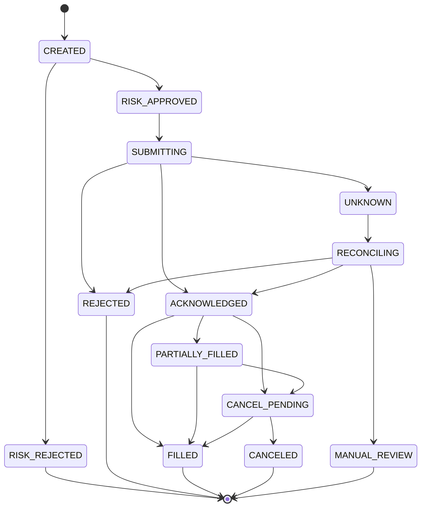
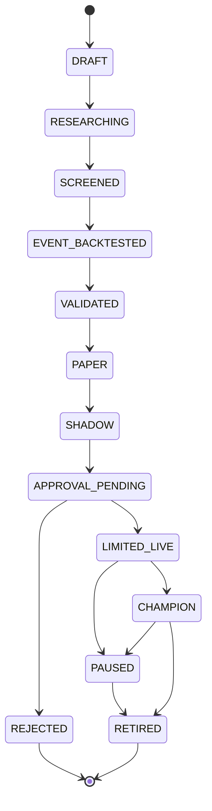
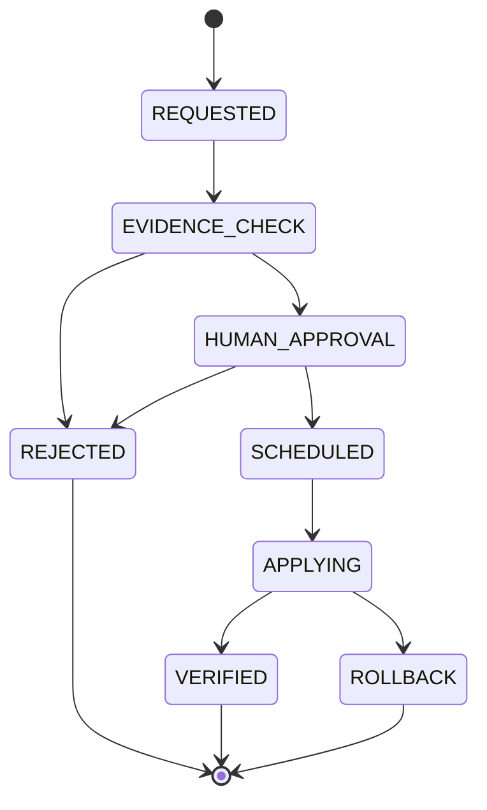

# 03. 도메인·데이터 모델

## 1. 도메인 모듈

| 모듈 | 핵심 객체 |
| --- | --- |
| Market | Instrument, Tick, Quote, Trade, Bar, MarketStatus, Calendar |
| Data lineage | RawEvent, CanonicalEvent, DatasetVersion, QualityIssue |
| Strategy | StrategyDefinition, StrategyVersion, Signal, TargetExposure, OrderIntent |
| AI overlay | EventAssessment, EvidenceReference, RiskMultiplier |
| Risk | RiskPolicy, RiskSnapshot, RiskDecision, KillSwitch |
| Trading | Order, BrokerOrder, Fill, CancelRequest, ExecutionAttempt |
| Ledger | CashEntry, PositionLot, PositionSnapshot, PnLEntry |
| Reconciliation | BrokerSnapshot, Mismatch, Resolution, ReconciliationRun |
| Research | Paper, Hypothesis, Experiment, BacktestRun, ValidationReport |
| Lifecycle | StrategyManifest, PromotionRequest, Approval, Deployment, Rollback |
| Operations | Alert, Incident, AuditEvent, ServiceHeartbeat |

각 모듈은 자신의 invariant를 소유한다. 예를 들어 `Strategy`가 현금을 계산하거나 `Market`이 주문을 제출하면 경계 위반이다.

## 2. 값 객체와 수치 규칙

- `Money(amount: Decimal, currency: Currency)`
- `Price(value: Decimal, currency: Currency)`
- `Quantity(value: Decimal, unit: SHARE)`
- `Ratio(value: Decimal)` — 범위를 별도 type으로 강제
- `Bps(value: int)`
- `InstrumentId(market, code)` — 표시명과 분리
- `AccountId`, `StrategyId`, `OrderIntentId`, `ClientOrderId`, `CorrelationId`
- `Timestamp` — timezone-aware UTC
- `TradingDate` — exchange calendar 기준 date

DB는 `NUMERIC`을 사용하고 Python은 `Decimal`을 사용한다. JSON serialization에서 숫자를 문자열로 보낼지 number로 보낼지는 contract에서 한 가지로 고정한다. ledger는 round-trip 정확성을 우선해 문자열 decimal을 권고한다.

## 3. 핵심 DB 테이블

정확한 DDL은 M01에서 migration으로 작성한다. 모든 table은 `created_at`, 필요한 경우 `updated_at`, audit actor/source를 가진다.

### 3.1 Reference·market

| 테이블 | 주요 필드 | 제약/용도 |
| --- | --- | --- |
| `instruments` | instrument_id, market, code, name, currency, tick_size, lot_size, valid_from/to | point-in-time symbol master |
| `trading_calendars` | market, trading_date, sessions, holiday_reason, version | calendar snapshot |
| `corporate_actions` | instrument_id, type, ex_date, announced_at, available_at, ratio, source_version | 미래정보 방지 |
| `market_events_meta` | event_id, topic, partition, offset, payload_hash, event/provider/ingest/available time | raw/object 위치 추적 |
| `market_bars` | instrument_id, interval, open_time, OHLCV, source_version, available_at | Timescale hypertable 후보 |
| `market_status` | instrument_id/market, status, event_time, reason | halt/auction/closed |

Raw payload 본문은 object storage/Parquet에 보존하고 DB에는 위치·hash·lineage를 둔다. 개인 또는 계약상 민감한 원문은 암호화·retention 정책을 별도로 둔다.

### 3.2 Feature·signal

| 테이블 | 주요 필드 | 제약/용도 |
| --- | --- | --- |
| `feature_sets` | feature_set_id, schema_version, code_digest, config_digest | feature contract |
| `feature_snapshots` | feature_set_id, instrument_id, event_time, available_at, values, input_offset_range | bitemporal lookup |
| `strategy_definitions` | strategy_id, name, family, owner, status | 논리 전략 |
| `strategy_versions` | strategy_version_id, strategy_id, code_digest, manifest_digest, artifact_uri | immutable version |
| `strategy_runtime_instances` | instance_id, version_id, environment, role, started/stopped_at | champion/challenger runtime |
| `signals` | signal_id, version_id, instrument_id, decision_time, target, confidence, feature_snapshot_id | immutable 판단 |
| `ai_event_assessments` | assessment_id, evidence_ids, available_at, multiplier, expiry, model_digest, raw_output_hash | AI trace |
| `order_intents` | intent_id, signal_id, account_id, instrument_id, side, quantity/notional, limit, ttl, idempotency_key | strategy의 최종 출력 |

`feature_snapshots` 조회는 반드시 `available_at <= decision_time`을 포함한다. latest row shortcut은 live/replay 모두에서 금지한다.

### 3.3 Risk·order

| 테이블 | 주요 필드 | 제약/용도 |
| --- | --- | --- |
| `risk_policies` | policy_id, version, environment, digest, active_from, approved_by | immutable policy |
| `risk_snapshots` | snapshot_id, account/position/cash/feed state, as_of, source_offsets | 판단 당시 입력 |
| `risk_decisions` | decision_id, intent_id, approved, reasons, adjusted_quantity, policy_id, snapshot_id | intent당 1개 활성 결정 |
| `orders` | order_id, intent_id, client_order_id, account_id, state, desired/filled qty, broker_order_id | authoritative internal order |
| `order_attempts` | attempt_id, order_id, fencing_token, request_hash, started/finished_at, outcome | side-effect audit |
| `broker_order_events` | broker_event_id, order_id, broker_seq, type, payload_hash, event/ingest time | dedupe |
| `fills` | fill_id, order_id, broker_fill_id, qty, price, fee, tax, event_time | unique broker fill |
| `outbox_events` | outbox_id, aggregate, event_type, payload, published_at | transactional publish |
| `inbox_events` | consumer, event_id, processed_at, result_hash | consumer dedupe |

필수 unique constraints:

- `order_intents(idempotency_key)`
- `orders(account_id, client_order_id)`
- `orders(intent_id)` — 한 intent의 실행 order를 1개로 제한하는 정책이면 사용
- `fills(account_id, broker_fill_id)`
- `broker_order_events(account_id, broker_event_id)`
- `inbox_events(consumer, event_id)`

### 3.4 Ledger·reconciliation

| 테이블 | 주요 필드 | 제약/용도 |
| --- | --- | --- |
| `ledger_entries` | entry_id, account_id, kind, instrument_id, amount/qty, currency, order/fill ref, effective_at | append-only double-entry 권고 |
| `position_lots` | lot_id, instrument_id, opened_by_fill, qty, cost, closed_at | long lot tracking |
| `position_snapshots` | account_id, instrument_id, qty, avg_cost, market_value, unrealized_pnl, as_of | 파생 read model |
| `cash_snapshots` | account_id, currency, available, settled, as_of | 파생 read model |
| `broker_snapshots` | snapshot_id, account_id, orders/positions/cash payload hash, captured_at | 외부 truth snapshot |
| `reconciliation_runs` | run_id, environment, started/completed, status, snapshot_id | 대사 단위 |
| `reconciliation_mismatches` | mismatch_id, run_id, type, severity, internal, broker, status, resolution | 불일치 lifecycle |

Position/cash snapshot은 ledger에서 재생성 가능해야 한다. broker snapshot과의 차이를 snapshot 값을 덮어써서 숨기지 않는다.

### 3.5 Research·promotion

| 테이블 | 주요 필드 | 제약/용도 |
| --- | --- | --- |
| `research_papers` | paper_id, DOI/arXiv, version, title, license, retraction_status, source | metadata |
| `hypotheses` | hypothesis_id, paper_id, mechanism, universe, horizon, inputs, failure_conditions | 사람이 검토 |
| `experiments` | experiment_id, hypothesis_id, code/data/config digests, search_budget, MLflow run | 모든 trial 연결 |
| `backtest_runs` | run_id, engine/version, period, costs, fill_model, metrics, artifact | event replay 결과 |
| `validation_reports` | report_id, run_ids, CV/DSR/PBO/stress results, verdict, policy_version | immutable evidence |
| `promotion_requests` | request_id, candidate_version, current_champion, report_id, requested_by, state | 상태기계 |
| `approvals` | approval_id, request_id, actor, scope, decision, reason, signed_at | 사람 승인 |
| `strategy_assignments` | environment, role, strategy_version_id, allocation, valid_from/to | champion/shadow truth |
| `rollback_targets` | assignment_id, target_version, tested_at | 즉시 복귀 |

## 4. Event envelope

모든 비동기 event는 공통 envelope를 사용한다.

```json
{
  "event_id": "01J...",
  "event_type": "orders.intent.created",
  "schema_version": 1,
  "source": "decision-plane",
  "environment": "paper",
  "correlation_id": "01J...",
  "causation_id": "01J...",
  "partition_key": "account:paper-main",
  "event_time": "2026-08-13T00:10:00.123Z",
  "provider_time": null,
  "ingested_at": "2026-08-13T00:10:00.140Z",
  "available_at": "2026-08-13T00:10:00.140Z",
  "sequence": 1842,
  "producer_version": "decision-plane@sha256:...",
  "payload_hash": "sha256:...",
  "payload": {}
}
```

`event_id`는 재전송해도 유지한다. 같은 사실을 수정해 새로 발행하면 새 `event_id`와 원본을 가리키는 `causation_id`를 사용한다.

## 5. 주문 상태기계



규칙:

- 상태 전이는 compare-and-swap/version column으로 보호한다.
- broker event가 역순 도착해도 monotonic facts를 잃지 않는다.
- `UNKNOWN`은 terminal이 아니다. 해당 account/symbol의 신규 주문 정책을 제한한다.
- partial fill 이후 cancel 성공 시 이미 체결된 수량은 ledger에 남는다.
- 수정 주문은 기존 order의 무음 변경이 아니라 cancel/replace lineage를 가진 새 command다.

## 6. 전략 lifecycle



`challenger`는 lifecycle state보다 assignment role이다. 같은 `SHADOW` version 여러 개가 challenger일 수 있다. `CHAMPION`은 environment/account별 최대 1개다.

## 7. Promotion 상태기계



승격 중 open order가 있으면 기본적으로 새 전략 적용을 지연한다. 강제 전환 정책은 owner가 별도 승인해야 한다.

## 8. Bitemporal 규칙

시장·공시·뉴스·재무·corporate action에 최소 두 시간축을 둔다.

- valid/event time: 현실에서 효력이 발생한 시각
- known/available time: 시스템이 사용할 수 있었던 시각

예:

```sql
SELECT *
FROM feature_snapshots
WHERE instrument_id = :instrument_id
  AND event_time <= :decision_time
  AND available_at <= :decision_time
ORDER BY event_time DESC, available_at DESC
LIMIT 1;
```

수정된 값이 나중에 들어오면 이전 row를 덮어쓰지 않고 version을 추가한다. backtest는 해당 decision 시점에 알려진 version을 사용한다.

## 9. 보존·삭제 정책 초안

| 데이터 | 기본 보존 | 비고 |
| --- | --- | --- |
| raw market/order payload | 최소 연구·감사 기간 전체 | 계약·용량에 따라 tiering |
| order/fill/ledger/audit | 삭제 금지에 준하는 장기 보존 | 개인정보 마스킹 |
| normalized events | raw로 재생성 가능하되 장기 보존 권고 | schema version 연결 |
| features | 재생성 가능 + 주요 run snapshot 보존 | 모든 transient feature 장기 보존 불필요 |
| logs/traces | 단기/중기 retention | audit 대체 불가 |
| research artifacts | promotion/결정에 쓰인 artifact는 장기 보존 | 실패 trial metadata도 유지 |
| paper full text | 라이선스에 따라 metadata-only 가능 | 원문 권리 확인 |

구체적 기간은 데이터 계약, 저장비용, 세무·규제 검토 후 확정한다.

## 10. 데이터 품질 규칙

- schema 필수값·enum·decimal scale
- symbol master 존재 및 해당 시각 valid
- timestamp timezone-aware, 미래 clock skew 제한
- sequence gap/duplicate/out-of-order
- OHLC invariant (`low <= open/close <= high`)
- 음수 volume·quantity 금지
- price tick/lot size 적합성
- bar completeness와 calendar/session 일치
- corporate action adjustment version
- feature input offset range와 output digest
- broker order/fill referential integrity
- ledger debit/credit balance

심각도:

- `BLOCKING`: 신규 진입 중단 또는 dataset/run 무효
- `QUARANTINE`: 해당 event/symbol 격리
- `WARNING`: 처리 가능하나 관측·검토 필요

