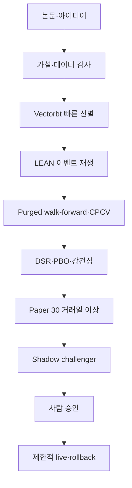

# 05. 전략 연구·검증·교체 명세

## 1. 목적과 원칙

이 plane의 목적은 논문이나 아이디어를 자동 매매로 직결하는 것이 아니라, 재현 가능한 가설로 변환해 강한 반증 절차를 통과시킨 뒤 사람의 승인 아래 제한적으로 배치하는 것이다.

- 논문 권위보다 데이터·코드·비용 모델·out-of-sample 결과를 우선한다.
- LLM은 후보 발굴·구조화·코드 초안·설명에 사용한다. 통계적 검증이나 승격 권한을 대신하지 않는다.
- 모든 실험은 code/data/config/environment digest로 재현 가능해야 한다.
- live와 backtest의 signal/risk 핵심 코드는 동일 package를 사용한다.
- 실패한 trial도 기록한다. 좋은 결과만 남기는 selection bias를 금지한다.
- champion은 별칭이 아니라 서명된 immutable manifest가 가리키는 정확한 artifact다.

## 2. 지원 전략 범위

MVP 전략 family:

| Family | 예시 | 보유 기간 | 대표 실패 조건 |
| --- | --- | --- | --- |
| Trend | breakout, moving-average/volatility scaled trend | intraday–5일 | 횡보·gap·과도한 turnover |
| Mean reversion | short-horizon z-score, liquidity-aware reversal | 15분–수일 | regime shift·falling knife·체결 악화 |
| Event | 공시/뉴스 기반 risk-aware event response | intraday–5일 | 발표 시각 오류·중복 뉴스·LLM hallucination |

허용 universe는 별도 versioned allowlist다. inverse/leveraged ETF, 관리/거래정지·유동성 기준 미달 종목은 기본 제외한다. 공매도·leverage·물타기는 전략 manifest에서 선언해도 risk engine이 차단한다.

## 3. 논문 수집·가설화

### 3.1 Source adapter

초기 후보 source: OpenAlex, Crossref, Semantic Scholar, arXiv와 사용권이 확인된 원문. 각 adapter는 DOI/arXiv ID, version, 발행·수정·철회 상태, license, retrieved_at을 보존한다.

### 3.2 LLM 추출 schema

LLM 출력은 반드시 schema validation과 사람 검토를 거친다.

```yaml
hypothesis_id: hyp-...
claim: "검증 가능한 단일 문장"
mechanism: "왜 alpha가 존재할 수 있는지"
universe: ["KRX liquid large caps"]
horizon: "15m..5d"
required_inputs:
  - name: adjusted_bars
    point_in_time_required: true
signal_definition: "수식 또는 결정 규칙"
entry_exit: "진입·청산·TTL"
cost_assumptions: [fees, tax, spread, slippage, market_impact]
failure_conditions: ["regime...", "capacity..."]
paper_evidence: [doi_or_url]
ambiguities: ["한국 시장 적용 시 ..."]
```

LLM이 하지 않는 것: 없는 수치 채우기, 철회 여부 추정, available time 생성, 검증 결과 판정, 전략 승격.

### 3.3 채택 전 체크

- 원 논문과 후속·반박 연구 확인
- 시장·기간·universe 차이 기록
- 데이터 라이선스와 point-in-time 가용성 확인
- 논문에 없는 parameter search 공간을 명시
- 전략 family 중복과 correlation 확인
- 실행 가능성, 예상 turnover/capacity, 세금·수수료 반영 가능성 확인

## 4. Strategy SDK 계약

전략은 broker SDK나 database를 직접 호출하지 않는 순수 결정 모듈이다.

```python
class Strategy(Protocol):
    manifest: StrategyManifest

    def on_snapshot(
        self,
        market: MarketSnapshot,
        features: FeatureSnapshot,
        portfolio: PortfolioView,
        clock: DecisionClock,
    ) -> list[TargetExposure]: ...
```

- wall clock, random, network, filesystem 직접 접근 금지.
- random이 필요하면 seed와 generator를 주입한다.
- 출력은 broker 주문이 아니라 target exposure 또는 order intent 초안이다.
- risk policy와 주문 sizing의 최종 권한은 독립 risk engine에 있다.
- 동일 input snapshot과 version은 byte-equivalent output을 내야 한다.
- stateful 전략은 event-sourced state와 deterministic restore를 제공한다.

### 4.1 Manifest 예시

```yaml
strategy_id: krx-trend
version: 0.1.0
artifact_digest: sha256:...
family: trend
owner: research-team
universe_version: krx-liquid-v1
feature_set_version: trend-features-v2
decision_interval: 1m
holding_horizon: 15m..5d
required_history: 120d
allowed_sides: [BUY, SELL_TO_CLOSE]
uses_ai_overlay: true
ai_overlay_semantics: exposure_multiplier_0_to_1_only
parameters:
  lookback: 20d
  volatility_target: "0.08"
runtime:
  python: "3.13"
  package_lock_digest: sha256:...
validation_report_id: val-...
```

## 5. 검증 funnel



각 gate가 실패하면 이전 gate로 자동 조정하지 않는다. 가설·parameter·data가 바뀌면 새 experiment lineage를 만든다.

## 6. 단계별 검증

### G0. 데이터·가설 감사

- point-in-time/available_at, corporate action, delisting, survivorship 확인
- 유동성·호가·auction·halt 처리 확인
- hypothesis와 primary metric, rejection condition을 실험 전에 등록
- search budget과 parameter range를 고정

### G1. 빠른 screening

Vectorbt/Polars로 다수 후보를 빠르게 걸러낸다. 여기의 fill은 낙관적일 수 있으므로 승격 근거로 단독 사용하지 않는다.

- gross/net return, turnover, drawdown, exposure, trade count
- baseline/buy-and-hold/cash와 비교
- fee·세금·spread 최소 1x 반영
- 명백한 look-ahead·parameter singularity 탐지

### G2. Event-driven replay

LEAN 또는 동일 수준 event simulator에서 다음을 반영한다.

- session/holiday/auction/halt, order latency, partial fill, reject/cancel
- bid/ask 또는 보수적 spread, slippage, fee, tax
- volume participation/capacity constraint
- signal 시각과 order availability 지연
- KIS paper/live capability 차이를 simulator profile로 분리

### G3. Out-of-sample 검증

- purged walk-forward: label/holding overlap을 purge하고 embargo 적용
- CPCV: 여러 경로의 결과 분포 확인
- regime slice: 추세/횡보, 고/저변동성, 상승/하락, 유동성 stress
- symbol/time slice: 특정 종목·기간 의존성 확인
- nested tuning 또는 엄격히 분리된 validation/test 사용

### G4. Multiple testing·강건성

- Deflated Sharpe Ratio(DSR): selection과 비정규성을 보정
- Probability of Backtest Overfitting(PBO): 선택된 후보의 순위 역전 위험
- parameter perturbation과 인접값 stability
- 비용 1x/2x/3x, latency, missed event, data gap, execution degradation stress
- bootstrap/confidence interval, drawdown duration, tail loss
- 전략 간 correlation과 aggregate exposure

### G5. Paper·shadow

- paper에서 최소 제안 기간 동안 end-to-end 운영
- real-time clock, 실 provider feed, 실제 adapter/risk/OMS 경로 사용
- signal-to-order latency, reject, reconciliation mismatch, restart recovery 기록
- shadow는 주문 없이 champion과 동일 시점 입력으로 판단하고 counterfactual execution을 별도 표시
- paper broker fill을 실제 체결 품질의 증명으로 오해하지 않는다.

## 7. Promotion policy 초안

아래 값은 모두 `PROPOSED`이며 owner/risk 검토 없이 live 기준이 아니다.

| 조건 | 제안 기준 | 비고 |
| --- | --- | --- |
| 재현성 | clean environment 2회 동일 digest/metric tolerance | 필수 |
| DSR | probability ≥ 0.95 | sample 가정 함께 보고 |
| PBO | ≤ 0.10, 최대 허용 0.20 검토 | 단독 gate 아님 |
| 비용 stress | 2x에서도 primary thesis 유지 | 3x 결과도 보고 |
| parameter stability | 인접 영역에서 성과 부호·risk 안정 | peak-only 탈락 |
| paper 기간 | 최소 30 거래일 | 전략 horizon에 따라 연장 |
| 운영 사고 | critical 0건, unresolved reconciliation 0건 | 필수 |
| risk | 모든 invariant/property test 통과 | 필수 |
| 승인 | researcher 외 risk approver 사람 승인 | live 필수 |
| rollback | 이전 champion restore rehearsal 통과 | 필수 |

최소 trade 수, 자본·position 한도, 허용 drawdown, capacity는 실제 universe와 자본 결정 후 policy에 수치화한다. 값이 비어 있으면 live gate는 fail-closed한다.

## 8. Champion/challenger 운용

- environment/account별 `champion` assignment는 최대 하나.
- challenger는 0개 이상 shadow로 실행하되 계산 자원 budget을 둔다.
- champion과 challenger 입력 offset·snapshot을 맞춰 비교한다.
- metric 차이뿐 아니라 원인을 regime, turnover, cost, execution, risk rejection으로 분해한다.
- 승격 시 manifest, validation report, policy, universe, feature, code/data digest를 서명한다.
- MLflow `champion` alias는 탐색 편의용이다. 실제 capital routing은 control-plane의 승인된 assignment만 결정한다.
- 승격 적용 전 open order·state migration을 검사한다. 기본은 flat/safe window 전환이다.
- 자동 rollback trigger가 작동해도 신규 진입 중지와 이전 version 복구 범위만 허용하며, 강제 청산은 별도 승인 정책이다.

## 9. AI event/risk overlay

AI 경로는 주 전략 경로 밖의 비동기 enrichment다.

입력:

- timestamp와 출처가 있는 공시/뉴스/event
- 중복 제거된 evidence reference
- 현재 보유·전략 exposure의 최소 필요 정보

출력:

```json
{
  "assessment_id": "01J...",
  "available_at": "2026-08-13T01:10:00Z",
  "expires_at": "2026-08-13T03:10:00Z",
  "risk_multiplier": "0.60",
  "confidence": "0.72",
  "evidence_ids": ["news:...", "dart:..."],
  "reasons": ["earnings uncertainty"],
  "model_digest": "sha256:..."
}
```

강제 invariant:

- `0 <= risk_multiplier <= 1`
- AI 결과는 base exposure를 증가시킬 수 없음
- stale/invalid/error/missing이면 정책상 `1` 또는 더 보수적인 fixed fallback을 명시; 임의 추정 금지
- AI는 symbol/order/account identifier를 새로 만들거나 주문 endpoint를 호출할 수 없음
- prompt/model/tool/evidence digest와 raw output hash를 감사 가능하게 보존
- prompt injection을 고려해 외부 문서는 untrusted data로 취급

## 10. 연구 재현성 manifest

각 validation report는 최소 다음을 연결한다.

- git commit와 dirty 여부
- source/package lock/container image digest
- dataset ID, object hashes, query snapshot, calendar/universe version
- feature/strategy/risk/cost/fill model version
- random seed, CPU/GPU/runtime 정보
- 모든 trial과 search budget
- train/validation/test window와 purge/embargo
- metric definition version
- 생성 artifact, logs, warnings, approver

## 11. 전략 폐기·교체

폐기 조건:

- invariant 위반, data leakage 발견, 논문 철회/핵심 오류
- live/paper 괴리가 허용 범위 초과
- 비용·capacity 변화로 net edge 상실
- regime 변화가 사전 정의된 stop condition을 충족
- 장기 미사용·owner 부재·dependency 취약점 미해결

폐기는 artifact 삭제가 아니다. assignment를 제거하고 `RETIRED`로 기록하며 재현·감사 자료는 보존한다.

## 12. 완료 조건

- [ ] sample 전략 하나가 동일 SDK로 screening, replay, paper를 수행함
- [ ] look-ahead와 survivorship 방지 test가 있음
- [ ] CPCV/DSR/PBO 구현을 reference dataset으로 검증함
- [ ] 모든 trial과 lineage가 MLflow/DVC 또는 대체 registry에 연결됨
- [ ] AI multiplier 불변식 property test가 있음
- [ ] shadow 비교와 promotion report가 자동 생성됨
- [ ] 사람 승인 없이 live assignment를 만들 수 없음
- [ ] rollback rehearsal 결과가 promotion evidence에 포함됨
