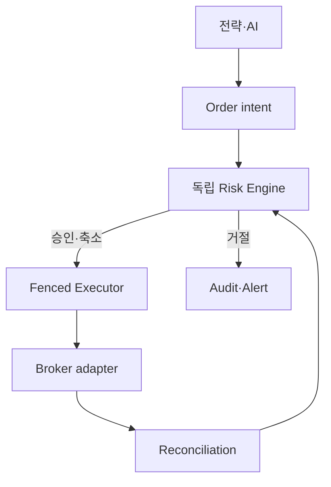

# 06. 리스크·보안·사고 대응 런북

## 1. 권한 경계

- 전략은 target/intention만 만든다.
- AI는 exposure multiplier `0..1`만 제공하며 증가·주문·승격은 불가하다.
- risk engine은 전략/AI와 독립 process·package·policy를 사용한다.
- broker write credential은 executor만 보유한다.
- reconciliation은 broker를 외부 사실원으로 조회하되 내부 이력을 덮어쓰지 않는다.
- UI는 broker와 직접 통신하지 않고 control-plane 명령만 사용한다.

## 2. 주문 전 risk 순서

fail-closed 순서의 예:

1. environment/account 일치, `live_enabled`, 거래 session 확인
2. global/account/strategy/symbol kill switch 확인
3. feed/calendar/symbol master freshness와 data quarantine 확인
4. broker/auth/reconciliation 상태와 executor lease/fencing 확인
5. intent schema, TTL, duplicate/idempotency, strategy assignment 확인
6. long/cash-only, leverage 금지, short 금지, averaging-down 금지
7. symbol/account/strategy notional·quantity·concentration·turnover 한도
8. available cash, unsettled cash 정책, open order 포함 exposure
9. price band, tick/lot, limit/market order 허용 정책, slippage guard
10. daily loss/drawdown, reject rate, anomalous activity guard
11. AI multiplier clamp 후 수량 축소; 증가 금지 재검사
12. 승인 snapshot·policy digest와 이유를 immutable 기록

어느 단계든 필요한 값이 누락되거나 stale이면 신규 진입은 거절한다. 단, 기존 위험을 줄이는 `SELL_TO_CLOSE`를 허용할지는 별도 reduce-only policy로 명시한다.

## 3. 핵심 불변식

| ID | 불변식 | 기계적 검사 |
| --- | --- | --- |
| R-001 | live는 기본 비활성 | config default false + startup gate |
| R-002 | AI는 exposure를 늘릴 수 없음 | `final <= base`, property test |
| R-003 | short position 불가 | projected quantity `>= 0` |
| R-004 | leverage 불가 | projected committed cash가 허용 현금 이하 |
| R-005 | averaging down 불가 | 손실 중인 기존 long에 BUY 차단 규칙 |
| R-006 | strategy가 broker를 직접 호출하지 않음 | dependency/credential boundary test |
| R-007 | intent은 risk 승인 없이 command가 되지 않음 | FK/state + executor check |
| R-008 | 한 account에 active executor 하나 | lease + monotonic fencing token |
| R-009 | timeout 주문 blind retry 금지 | UNKNOWN state contract test |
| R-010 | unresolved mismatch 시 신규 위험 제한 | reconciliation gate |
| R-011 | 승인된 artifact만 assignment 가능 | signed manifest/digest check |
| R-012 | live promotion은 사람 승인 필요 | RBAC + approval record |

### 3.1 Averaging-down의 정확한 정의

제안 기본 규칙:

`current_qty > 0 AND mark_price < weighted_avg_cost AND projected_buy_qty > 0`이면 BUY를 차단한다.

예외를 두려면 risk policy version에 symbol/strategy/scope/만료/승인자를 명시해야 한다. 단순 rebalance가 물타기처럼 보이는 경우도 있으므로 target exposure 계산 후 projected position 기준으로 검사한다. MVP에는 예외를 두지 않는다.

## 4. Kill switch

| Scope | 효과 | 해제 조건 |
| --- | --- | --- |
| global | 모든 account 신규 command 중지 | 최고 권한 + 원인 해소 + 대사 |
| environment | paper 또는 live만 중지 | environment operator 승인 |
| account | 특정 계좌 신규 command 중지 | cash/order/position 대사 |
| strategy | 해당 version/assignment intent 중지 | owner+risk 검토 |
| symbol | 해당 종목 신규 진입 중지 | feed/halt/quality 정상화 |
| data source | source 의존 판단 중지 | gap 복구·replay 확인 |

중요: kill switch는 기본적으로 신규 위험 증가를 막는다. `cancel-all`, `reduce-only`, `flatten`은 서로 다른 명령과 권한이다. 자동 flatten은 가격 급변과 중복 주문 위험이 있으므로 MVP에서 비활성이다.

자동 trigger 초안:

- feed stale/gap이 policy 한도 초과
- executor lease/fencing 불확실
- broker auth 반복 실패 또는 주문 reject 폭증
- 내부와 broker position/cash critical mismatch
- daily loss/drawdown 한도 초과
- event lag/clock skew가 판단 신뢰 범위 초과
- 승인되지 않은 artifact/policy digest 탐지

trigger 수치는 paper 관측 후 policy owner가 확정한다. 수치가 없으면 live 활성화가 실패해야 한다.

## 5. Executor fencing과 중복 방지

1. executor는 account별 lease를 획득하며 저장소가 단조 증가 `fencing_token`을 발급한다.
2. order attempt, command, audit에 token을 기록한다.
3. lease 상실 시 신규 broker call을 즉시 중지한다.
4. stale token command는 executor와 저장소 양쪽에서 거절한다.
5. `client_order_id`/idempotency key를 account 범위 unique로 둔다.
6. broker가 key를 지원하지 않으면 submit 전후 open order 조회와 request fingerprint로 보강한다.
7. network timeout은 `UNKNOWN`; 동일 주문 재제출 전에 broker state를 조회한다.

DB lock 하나만으로 network partition 중 split-brain을 해결했다고 가정하지 않는다. lease TTL, heartbeat, fencing, broker reconciliation을 함께 test한다.

## 6. Reconciliation

주기:

- 주문 직후 ACK/fill event 기반 지속 대사
- 장중 짧은 주기 open order/position/cash snapshot
- 장 시작 전·장 종료 후 full reconciliation
- reconnect, timeout, restart, promotion 전후 즉시 실행

불일치 severity 예:

| Severity | 예 | 기본 조치 |
| --- | --- | --- |
| INFO | 반올림·표시 지연 | 기록 후 다음 cycle 확인 |
| WARNING | known propagation lag | 해당 symbol 주의, 관측 |
| HIGH | order state/fill 불일치 | account 신규 주문 차단, 재조회 |
| CRITICAL | position/cash 방향·수량 불일치 | account/global kill, 사람 대응 |

resolution은 `IGNORE`로 덮지 않는다. 원인, evidence, 승인자, correction ledger entry 또는 상태 전이, 재발 방지 작업을 연결한다.

## 7. 보안 설계

### 7.1 Secret·계정 분리

- KIS app key/secret, account number, token은 secret manager 또는 환경별 encrypted store에 저장한다.
- secret은 source, image, CI artifact, event, log, trace, screenshot에 넣지 않는다.
- paper/live app·account·topic·DB·object prefix를 분리한다.
- executor만 broker write secret을 읽고 decision/research/web에는 주지 않는다.
- credential rotation·폐기 절차와 마지막 사용 시각을 감사한다.
- 개발자는 실제 live secret 없이 simulator/fixture로 작업한다.

### 7.2 Supply chain

- dependency lockfile과 container digest 고정
- SBOM 생성, license/취약점 scan, 서명된 build provenance
- CI에서 secret scan, SAST, dependency audit
- artifact registry immutable tag/digest 사용
- critical vulnerability 예외는 owner, 만료, 보완통제 기록

### 7.3 Threat model 요약

| 위협 | 통제 |
| --- | --- |
| 탈취된 UI/session | MFA, RBAC, step-up, short session, audit |
| prompt injection/news 조작 | untrusted input, tool-free AI, source allowlist, evidence, multiplier clamp |
| event 위조/재생 | service identity, ACL, schema/hash, inbox dedupe |
| stale executor/split brain | lease, fencing, single writer, reconciliation |
| data poisoning/look-ahead | raw immutability, available_at, lineage, quality gate |
| artifact 교체 | signed digest, admission check, approval |
| credential 유출 | least privilege, redaction, rotation, network egress control |
| operator 실수 | paper default, confirmation, two-person live actions, rollback |

## 8. 관측해야 할 risk metric

- `risk_decisions_total{decision,rule,strategy}`
- `risk_headroom_ratio{limit,account}`
- `order_unknown_total`, `order_state_age_seconds{state}`
- `reconciliation_mismatches{severity,type}`
- `executor_fencing_token`, `executor_lease_healthy`
- `market_data_age_seconds{source,symbol}`, `sequence_gap_total`
- `position_notional`, `gross_exposure`, `cash_available`
- `daily_realized_pnl`, `drawdown_ratio`
- `ai_multiplier{model,strategy}`, invalid/stale/error count
- `live_write_attempt_total{actor,service}`

metric label에 account number, order ID, symbol 전체 universe처럼 cardinality·민감도가 큰 값을 무분별하게 넣지 않는다. 상세 correlation은 structured log/trace로 연결한다.

## 9. 사고 대응 공통 절차

1. 감지 시각·환경·account·영향을 기록하고 incident ID 생성
2. 위험 증가 차단: 적절한 kill switch; 즉시 flatten은 기본 아님
3. executor lease와 live write path 확인
4. broker를 조회해 open order/position/cash snapshot 보존
5. 관련 event offset, logs, traces, policy/artifact digest 보존
6. UNKNOWN order부터 대사하고 중복 주문을 피함
7. 복구 plan과 rollback target을 사람에게 제시
8. 실행 후 재대사·golden invariant 확인
9. 원인/탐지 공백/재발 방지/owner/기한 기록

## 10. 상황별 런북

### 10.1 Market WS gap/stale

- symbol/source kill, 신규 진입 차단
- sequence·heartbeat·provider status와 local network 확인
- REST snapshot/backfill 가능 여부 확인하되 event time/available_at 구분
- gap 구간을 archive에 표시하고 replay 후 bar/feature 재계산
- live runtime이 gap 이전 state와 일치하는지 checksum 확인
- 정상 fresh window가 policy 기간 지속된 후 승인 해제

### 10.2 Submit timeout/결과 미상

- order를 `UNKNOWN`, account/symbol 신규 submit 제한
- 동일 client ID/fingerprint로 broker open order·history 조회
- ACK/fill을 발견하면 사실대로 연결; 없더라도 provider의 관측 가능 지연 전 blind retry 금지
- 정책 timeout 후에도 판정 불가하면 `MANUAL_REVIEW`
- duplicate가 발견되면 임의 삭제하지 않고 cancel 가능성과 fill risk를 평가

### 10.3 Executor split-brain 의심

- global/account kill, 두 executor의 lease/token/heartbeat 보존
- broker open orders와 attempt token 비교
- stale instance 종료 확인 전 신규 writer 시작 금지
- 최신 fencing token의 상태만 authoritative로 복구
- duplicate 여부 대사 후 single-writer chaos test 재실행

### 10.4 Position/cash mismatch

- severity HIGH/CRITICAL, account kill
- broker snapshot을 반복 조회해 transient 여부 확인
- fill/fee/tax/corporate action/settlement/timezone 순으로 lineage 추적
- correction은 명시적 ledger adjustment와 approval로 수행
- snapshot 값을 직접 덮어써 mismatch를 숨기지 않음

### 10.5 AI overlay failure/오염

- AI overlay bypass policy를 적용하되 base strategy와 risk engine은 독립 유지
- invalid multiplier는 clamp해서 쓰기보다 event를 거절하고 명시된 fallback 사용
- model/prompt/evidence digest, raw output hash 보존
- 외부 문서에 의한 prompt injection/PII/secret 노출 조사
- AI가 exposure를 증가시킨 흔적이 하나라도 있으면 strategy/account 중지 및 전수 audit

### 10.6 Credential 유출

- 해당 credential 폐기·rotation, executor 중지
- broker open order/position과 audit 조회
- log/artifact/event에서 노출 범위 조사 및 접근 차단
- 새로운 credential은 secret store를 통해서만 배포
- 재발 방지와 필요 시 법무·컴플라이언스 절차 수행

## 11. Live readiness gate

- [ ] 외부 broker 약관·API 제한·데이터 사용권 검토
- [ ] paper/live credential과 모든 저장소 격리
- [ ] universe, capital, position/daily-loss/drawdown 수치 승인
- [ ] kill/cancel/reduce/flatten 의미와 권한 승인
- [ ] single executor/fencing/timeout/reconciliation chaos test 통과
- [ ] restore, rollback, credential rotation rehearsal 통과
- [ ] 최소 paper/shadow 기간과 promotion evidence 충족
- [ ] on-call owner, incident channel, escalation 연락망 확정
- [ ] RTO/RPO, backup, retention 확정
- [ ] 작은 capital·allowlist·제한 시간으로 limited-live plan 승인
- [ ] `live_enabled` 변경에 두 사람 승인과 만료/rollback 계획 존재

## 12. 면책과 검토 범위

이 문서는 소프트웨어 안전 설계 명세이며 투자 성과를 보장하거나 법률·세무·규제 자문을 제공하지 않는다. 실제 거래 전 한국의 관련 규정, broker 계약, market data license, 세금과 운영 통제를 적격 전문가와 검토한다.
