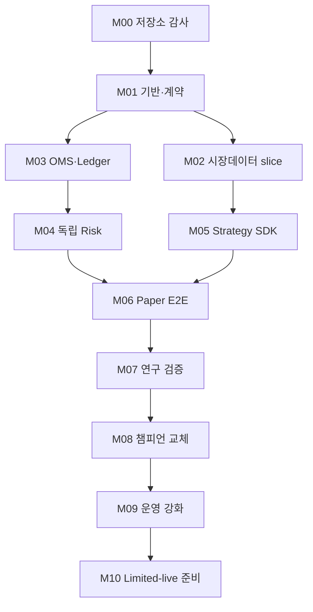

# 07. 구현 로드맵·백로그

## 1. 실행 원칙

- 첫 milestone은 기존 repository 감사다. 확인 전 기존 기술·배포·기능을 추정해 삭제하지 않는다.
- milestone 하나를 하나의 Codex 작업 단위로 삼고, active plan은 `plans/active/`에 둔다.
- 각 milestone은 얇은 end-to-end vertical slice를 우선한다.
- broker write path보다 replay, simulator, risk, ledger, reconciliation을 먼저 완성한다.
- paper에서 동일 경로를 검증한 뒤에만 limited live를 별도 프로젝트로 연다.
- `PROPOSED` 수치와 `TBD`는 임의로 확정하지 않는다.

## 2. 의존 관계

M2와 M3는 M1 뒤 병렬화 가능하다. M4와 M5도 계약이 고정되면 일부 병렬화 가능하나, 같은 file/schema를 동시에 수정하지 않도록 worktree와 owner를 분리한다.

## 3. 공통 milestone 완료 조건

- acceptance criteria가 test로 표현됨
- unit/contract/integration test와 lint/typecheck 통과
- event/API/schema 변경이 문서·fixture·migration에 반영됨
- logs/metrics/traces와 오류·retry semantics 구현
- threat/risk impact 검토, secret 없음
- compose에서 clean bootstrap 및 rollback 경로 검증
- README/ADR/active plan의 결정과 잔여 위험 갱신
- 독립 review에서 critical/high 이슈 0개

## 4. M00 — Repository discovery·현황 감사

목표: 현재 저장소의 사실을 파악해 보존·재사용·교체 계획을 만든다. 기능 구현을 시작하지 않는다.

작업:

1. `AGENTS.md`, README, package/lock, CI, deploy, env example, migration, test 순서로 읽기
2. language/framework/runtime, entrypoint, service, DB, external integration inventory
3. `rg`로 Alpaca/KIS/Toss, React/Vite, Cloudflare, Gmail/Notion, secret 접근과 broker call 위치 확인
4. 실행 가능한 bootstrap/test/build를 secret 없이 시도
5. 현재 order flow, data flow, auth, deployment diagram 작성
6. requested target과 gap matrix: keep/adapt/replace/remove/unknown
7. uncommitted user change를 보존하고 destructive migration 금지
8. 발견된 risk, credential exposure 가능성, missing test 보고

산출물:

- `docs/current-state.md`
- `docs/gap-analysis.md`
- `docs/adr/0000-repository-migration.md`
- `plans/active/M01-foundation.md`

Done when:

- 모든 deployable·external dependency·broker write path가 추적됨
- 기존 build/test 결과와 실패 원인이 재현됨
- 삭제 후보마다 parity/rollback 조건이 있음
- owner가 target layout과 migration 순서 승인

## 5. M01 — Foundation·local platform·contract skeleton

목표: 안전 invariant와 계약을 강제할 수 있는 최소 monorepo/platform을 세운다.

작업:

- repo layout 확정: `apps/`, `services/`, `packages/`, `contracts/`, `infra/`, `tests/`
- Python 3.13/uv 또는 선택된 lock tool, Ruff, mypy/pyright, pytest
- frontend가 유지된다면 Node lock/lint/test/build 연결
- shared domain types, decimal/time/environment types
- Protobuf/event schema, OpenAPI skeleton, schema registry compatibility
- Compose: Redpanda, Postgres/Timescale, Redis, MinIO/S3-compatible, observability dev profile
- environment config hierarchy와 `live_enabled=false`
- outbox/inbox base, migration framework, structured logging/OTel bootstrap
- CI: format, lint, type, unit, contract, secret/dependency scan

Done when:

- fresh clone에서 문서화된 한 명령으로 dependency와 test bootstrap
- paper stack health/readiness 확인
- live credential 없이 CI 통과
- sample event의 produce→consume→dedupe→outbox test 통과
- forbidden dependency test로 strategy→broker 직접 import 차단

## 6. M02 — KIS paper 시장데이터 vertical slice

목표: KIS stream을 loss-aware하게 수집해 raw→normalized→bar→storage→replay 한 경로를 만든다.

작업:

- KIS paper auth, WS subscription, heartbeat, reconnect/resubscribe
- rate/subscription limit을 config와 metric으로 노출
- raw payload archive + metadata hash
- canonical tick/quote/trade normalizer와 symbol/calendar adapter
- sequence gap, duplicate, out-of-order, stale detector
- 1m bar builder와 available_at semantics
- Timescale write, Parquet partition, replay CLI
- provider simulator/recorded fixture contract test

Done when:

- allowlist 몇 종목을 장중 지속 수집하고 disconnect recovery 성공
- raw replay가 normalized/bar golden checksum 재현
- gap은 숨지 않고 quality event·alert·quarantine 생성
- 시간대/장휴일/OHLC invariant test 통과

## 7. M03 — OMS·append-only ledger·reconciliation

목표: broker simulator와 KIS paper에서 주문 lifecycle과 내부 장부를 안전하게 추적한다.

작업:

- intent/order/attempt/broker-event/fill schema와 state machine
- deterministic `client_order_id`, idempotency, outbox/inbox
- broker simulator: ACK/reject/partial fill/cancel/timeout/duplicate/out-of-order
- KIS paper order adapter와 normalized error taxonomy
- ledger entry, position/cash read model
- periodic/on-demand reconciliation과 mismatch lifecycle
- UNKNOWN→RECONCILING→resolved/manual review
- account-level lease/fencing executor

Done when:

- duplicate intent/event에도 broker side effect와 fill/ledger가 1회
- submit timeout test가 blind retry 없이 대사로 해결
- restart/replay 후 order/position/cash checksum 일치
- partial fill+cancel, late fill, out-of-order event test 통과
- split-brain chaos test에서 stale writer가 차단됨

## 8. M04 — 독립 Risk Engine

목표: 모든 broker command 앞에서 장기 불변식과 versioned policy를 독립적으로 강제한다.

작업:

- RiskGateway 계약과 immutable snapshot/decision
- long/cash-only, no leverage/short/averaging-down
- notional, concentration, turnover, cash, price/slippage, freshness, loss limits
- AI multiplier clamp와 `final_exposure <= base_exposure`
- global/account/strategy/symbol kill switches
- reconciliation/UNKNOWN/executor lease gates
- proposed policy config schema와 approval audit
- property-based invariant tests

Done when:

- 승인되지 않은 command를 executor가 이중 차단
- 모든 R-001..R-012 invariant test 통과
- missing/stale/NaN/overflow/negative/randomized input에서 fail-closed
- policy 변경은 version/approval/audit 없이는 활성화 불가

## 9. M05 — Feature runtime·Strategy SDK·sample strategies

목표: live/replay 공용 deterministic 판단 경로와 representative strategy를 만든다.

작업:

- point-in-time feature lookup, feature manifest/digest
- deterministic clock/state restore/seed rules
- Strategy SDK와 dependency boundary
- trend 1개, mean-reversion 1개를 단순 baseline으로 구현
- event strategy는 curated fixture로 skeleton; AI overlay는 mock부터 시작
- target→intent sizing 전 단계 분리
- golden replay와 performance profile

Done when:

- 같은 data offset/code/config는 같은 signal digest
- restart 후 stateful output 일치
- latest-data leakage test와 shifted-available_at test 통과
- strategy가 broker/database/network를 직접 사용하지 않음
- baseline은 성과와 무관하게 risk/OMS E2E fixture를 제공

## 10. M06 — Paper E2E·운영 UI

목표: 실제 KIS paper feed/account에서 관측 가능한 end-to-end loop를 운영한다.

경로: market→feature→strategy→AI mock/overlay→intent→risk→executor→broker→fill→ledger→reconciliation→UI.

작업:

- 4개 backend deployable(data/decision/control/research) 조립
- control REST API와 web overview/orders/positions/risk/reconciliation
- environment banner, freshness, role, kill state
- command confirmations, RBAC, audit timeline
- Prometheus/Grafana/Alertmanager/OTel/Loki dashboard
- restart, dependency outage, market close/open operational test

Done when:

- 최소 연속 paper session에서 critical mismatch 0
- operator가 UI에서 각 주문의 signal→risk→broker→fill lineage 추적
- stale feed, broker outage, UNKNOWN order가 올바른 kill/alert를 생성
- deploy/restart 후 duplicate order 없음
- 장애·복구 runbook rehearsal 완료

## 11. M07 — 논문 pipeline·backtest validation

목표: 한 가설을 수집부터 재현 가능한 validation report까지 통과시킨다.

작업:

- paper metadata adapter와 hypothesis schema/사람 review
- Dagster asset/job, DVC dataset lineage, MLflow experiment registry
- vectorbt fast screening, LEAN event-driven replay adapter
- cost/fill/latency profile와 Korean market calendar
- purged walk-forward, CPCV, DSR, PBO, bootstrap/stress
- all-trials retention과 report generator

Done when:

- reference strategy/run을 clean environment에서 재현
- deliberate look-ahead/survivorship leak가 test에서 실패
- code/data/config/container digest가 report와 artifact를 완전 연결
- 결과가 좋지 않아도 실패 trial 포함 report가 생성

## 12. M08 — Champion/challenger·promotion·rollback

목표: shadow 비교와 사람 승인을 거친 strategy assignment 전환을 안전하게 자동화한다.

작업:

- lifecycle/promotion state machine과 signed manifest
- champion 1개 invariant, multi-challenger budget
- synchronized shadow input과 comparison dashboard
- proposed promotion gate evaluator
- requester/approver 분리, safe deployment window
- open order/state compatibility check
- previous champion rollback rehearsal

Done when:

- 승인 없는 promotion/apply 거절
- alias만 바꿔서는 capital routing이 변하지 않음
- artifact digest mismatch admission 차단
- promotion 실패를 simulated fault로 만들고 자동 신규진입 중지+rollback 검증

## 13. M09 — 보안·신뢰성·운영 강화

목표: limited-live 검토에 앞서 failure mode와 운영 통제를 증명한다.

작업:

- workload identity/RBAC/MFA/step-up, secret rotation
- SBOM, image signing, SAST/DAST/dependency/secret scan
- load/soak/latency, event lag/backpressure, disk pressure test
- chaos: WS flap, Kafka/Postgres restart, clock skew, split brain, broker timeout
- backup/restore, PITR, object versioning, DR rehearsal
- SLO/dashboard/page policy와 incident templates
- data license·retention·PII review

Done when:

- approved SLO 하에서 paper soak test 통과
- RTO/RPO rehearsal 결과가 목표 안
- critical/high security finding 0 또는 승인된 기한부 예외
- on-call과 kill/reconciliation/rollback 훈련 완료

## 14. M10 — Limited-live readiness (별도 승인 프로젝트)

M10은 자동 진입하지 않는다. 법률/규정/broker 계약/세무 검토와 owner 승인 후 새 execution plan을 만든다.

필수 범위:

- 매우 작은 승인 자본, allowlist, trading window, order type
- paper/live capability matrix 재검증
- live secret·account·topic·DB 완전 분리
- two-person activation, 만료되는 enablement, immediate kill
- 첫 주문 전 dry-run, 첫 주문 사람 관찰, 점진적 한도
- 일별 reconciliation과 go/no-go review
- 명확한 중단·rollback·자본 회수 기준

Done when은 사전에 승인된 limited-live charter에서만 정의한다. 이 문서 자체는 실거래를 승인하지 않는다.

## 15. 우선순위 밖 백로그와 도입 trigger

| 기술/작업 | 지금 하지 않는 이유 | 재검토 trigger |
| --- | --- | --- |
| Kubernetes | Compose로 충분한 초기 규모 | 다중 노드/HA/독립 배포·팀 필요 |
| Flink | event-time state 복잡성 대비 비용 | Python consumer가 lag/SLO를 반복 위반 |
| ClickHouse | Postgres/Parquet로 시작 가능 | 분석 query가 운영 DB를 압박, 대규모 tick 탐색 |
| Feast | feature registry 운영비 | online/offline skew와 다수 팀 공유 문제 |
| Temporal | state machine+Dagster로 시작 | 장기 workflow 복구/보상 로직이 과도해짐 |
| Rust/Go hot path | Python 개발 속도 우선 | profile로 확인된 latency/CPU bottleneck |
| Toss adapter | KIS vertical slice가 우선 | 공식 API·계약·capability 확인 후 |
| 다계좌/공매도/레버리지 | 안전 범위 밖 | 별도 risk/규제 프로젝트 승인 후 |

## 16. 초기 12주 예시

기간은 팀 규모와 장중 KIS test 가능성에 따라 조정한다.

| 주 | 목표 |
| --- | --- |
| 1 | M00 감사·migration ADR |
| 2–3 | M01 contracts/compose/CI |
| 4–5 | M02 data slice |
| 4–6 | M03 simulator/OMS/ledger |
| 7 | M04 risk invariants |
| 8 | M05 SDK/baseline |
| 9–10 | M06 paper E2E/UI/observability |
| 11 | fault/reconciliation soak |
| 12 | MVP acceptance review, M07 plan |

일정 압박이 있어도 risk, idempotency, ledger, reconciliation, test를 생략하지 않는다. scope를 줄일 때는 universe/전략/UI 기능을 줄인다.
