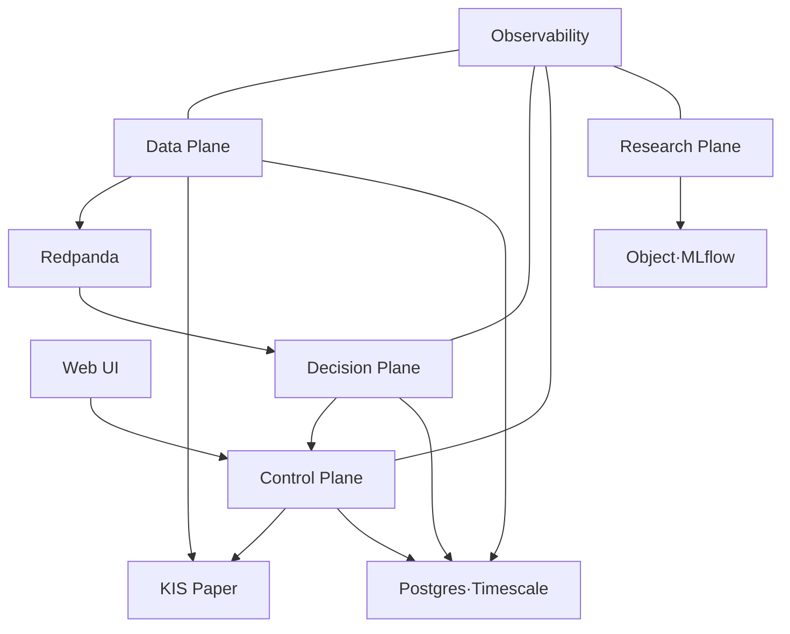

# 09. 배포·운영 명세

## 1. 배포 환경

| 환경 | 목적 | Broker | 데이터/credential | 변경 승인 |
| --- | --- | --- | --- | --- |
| local | 개발·fixture·simulator | simulator | synthetic/recorded, secret 없음 | 개발자 |
| test | CI integration | simulator | ephemeral | CI |
| paper | 장중 E2E·shadow | KIS paper | paper 전용 완전 격리 | operator |
| live | 제한 실거래 후보 | KIS live | live 전용 완전 격리 | two-person + charter |

paper와 live는 config flag만 다른 동일 namespace로 만들지 않는다. credential, account, broker base URL, stream topic prefix, Postgres DB/role, Redis key prefix, object bucket/prefix, encryption key, dashboards/alerts를 분리한다.

## 2. MVP 물리 topology

물리 deployable:

- `data-plane`: KIS market adapter, raw archive, normalizer, quality, bars
- `decision-plane`: feature runtime, strategy runtimes, AI overlay consumer, intent builder
- `control-plane`: API, risk engine module/process, OMS, fenced executor, ledger, reconciliation, promotion controller
- `research-plane`: Dagster worker/web, backtest runners, report/registry adapters
- `web`: React/Vite가 기존에 확인되면 우선 보존; 실제 M00 결과로 확정

독립 risk를 보장하기 위해 초기에는 control-plane 배포 안의 별도 process/package/credential boundary로 두고, 부하/팀/장애 격리 요구 시 별도 deployable로 분리한다.

## 3. Docker Compose profile

예상 service:

- application: `data-plane`, `decision-plane`, `control-plane`, `research-worker`, `research-web`, `web`
- state: `redpanda`, `schema-registry`, `postgres-timescale`, `redis`, `minio`
- observability: `prometheus`, `grafana`, `alertmanager`, `otel-collector`, `loki`
- test-only: `broker-simulator`, `toxiproxy`

profile 예:

- `core`: state dependencies
- `paper`: core + application + web
- `research`: core + research
- `observability`: metrics/logs/traces
- `test`: simulator/fault tooling

healthcheck와 startup dependency는 준비 상태를 돕지만 correctness를 보장하지 않는다. consumer는 dependency reconnect/retry/backoff를 구현한다.

## 4. Configuration

우선순위 예: code defaults < versioned environment config < secret references < one-time runtime flags. safety-sensitive 값은 runtime arbitrary override를 금지한다.

필수 config group:

- `environment`, `service_name`, version/digest
- market source, universe version, session calendar
- broker base/capability/account reference, rate limit
- stream brokers/topic prefix/schema registry
- Postgres/Redis/object references
- risk policy version, `live_enabled=false`
- executor lease/fencing, reconciliation cadence
- observability endpoint/sampling/redaction
- AI model/prompt/evidence policy와 fallback

startup validation:

- unknown key, 잘못된 단위, 중복 environment, missing secret reference를 거절
- live 환경에서 placeholder/미승인 limit/unsigned artifact가 있으면 종료
- paper credential이 live endpoint와 결합되거나 반대이면 종료
- 활성 config의 redacted summary와 digest를 audit/metric에 남김

## 5. 상태 저장·고가용성

### 5.1 Postgres/Timescale

- transactional truth: order, risk, ledger, lifecycle, audit
- migration은 expand→backfill→switch→contract 순서
- ledger/event ID unique constraints를 application check보다 우선
- backup, WAL/PITR, encryption, connection pool, slow query 관측
- 운영 DB에 research full scan 금지; replica/export/Parquet 사용

### 5.2 Redpanda/Kafka

- replication/acks/min ISR은 배포 topology에 맞춰 loss tolerance 확정
- 주문 topic retention/compaction은 감사·replay 요구와 검토
- DLQ가 오류를 숨기는 쓰레기통이 되지 않도록 owner/replay 절차 제공
- consumer lag, under-replicated partition, disk, schema rejection alert

### 5.3 Object storage

- raw/normalized/research artifact partition과 immutable/versioning
- checksum, lifecycle tiering, encryption, least-privilege policy
- dataset manifest가 object hash와 row/time coverage를 연결
- 연구 원문은 license에 따라 metadata-only 가능

### 5.4 Redis

- cache, rate limiter, ephemeral coordination만 사용
- order/ledger authoritative truth를 두지 않는다.
- executor lease에 사용한다면 fencing token의 durable monotonic source와 failure semantics를 별도 증명한다.

## 6. Observability

### 6.1 Golden signals

- latency: provider→ingest, decision, risk, executor, broker ACK
- traffic: events/s, bars/s, intents/orders/fills/s
- errors: parse/schema/reject/UNKNOWN/mismatch/retry
- saturation: consumer lag, queue, DB pool, CPU/memory/disk, broker rate budget
- correctness: freshness, sequence gaps, executor lease, reconciliation, ledger checksum

### 6.2 Trace/correlation

`market event → bar → feature → signal → intent → risk decision → command → broker event → fill → ledger`에 correlation/causation ID를 연결한다. high-volume tick 전체 trace는 sampling하되 주문·risk·error trace는 보존 정책을 강화한다.

### 6.3 Dashboard

1. Executive safety: environment, live disabled/enabled, kill state, exposure, daily PnL, mismatch
2. Market health: connection, freshness, gap, universe coverage, bar lag
3. Decision: feature/signal lag, strategy heartbeat, AI status/multiplier
4. Orders: queue, state age, UNKNOWN, reject, fill, cancel
5. Risk: headroom, rejection rules, policy/version
6. Reconciliation: last success, mismatch age/severity
7. Research: active runs, resource use, failed jobs
8. Infra: Redpanda/Postgres/object/host health

### 6.4 Alert routing

- page: live write anomaly, critical mismatch, split brain, risk bypass, feed stale while exposed
- urgent ticket/chat: repeated UNKNOWN/reject, backup failure, high lag, expiring credential
- dashboard only: low impact warning, research job failure

alert는 owner, severity, runbook link, environment/account scope, correlation ID를 포함한다. paper alert가 live page처럼 보이지 않게 route/label을 분리한다.

## 7. Deployment workflow

1. PR gates 통과
2. immutable image build, SBOM/sign/signature
3. schema/migration compatibility 검증
4. local/test replay+fault suite
5. paper canary deploy; readiness와 offsets 확인
6. reconciliation/golden smoke
7. paper full rollout와 soak
8. release note: code/config/schema/data/risk 영향과 rollback

애플리케이션 배포와 전략 promotion은 별개다. 새 service version 배포가 champion assignment를 자동 변경하지 않는다.

### 7.1 Rolling deployment 안전

- schema는 old/new consumer 동시 동작 가능
- executor는 account별 single writer이므로 일반적인 동시 rolling replica로 write path를 겹치지 않음
- 새 executor가 higher fencing token lease를 얻은 뒤 old가 write 불가함을 검증
- consumer offset/state checkpoint와 idempotency 유지
- warmup 중 전략 output은 shadow로 비교하고 바로 broker command로 보내지 않음

### 7.2 Migration rollback

- destructive DB contract step은 최소 한 release 뒤 수행
- 데이터 backfill은 idempotent, progress/checksum 기록
- rollback이 불가능한 migration은 backup restore rehearsal와 owner 승인
- event schema는 consumer rollback window 동안 호환 유지

## 8. Backup·복구·DR

대상:

- Postgres base backup+WAL/PITR
- object storage versioning/replication과 manifest
- Redpanda는 replay buffer이나 유일한 영구 원장으로 간주하지 않음; 정책에 맞춘 snapshot/export
- config, schema, image, signed strategy/risk manifest
- secret 자체와 복구 절차는 secret manager 정책 사용

복구 우선순위:

1. live write 차단 확인
2. order/fill/ledger/audit와 broker snapshot
3. risk policy/assignment/executor fencing state
4. market replay/state rebuild
5. research/UI

복구 후 반드시 broker full reconciliation, ledger checksum, pending UNKNOWN/open orders, assignment/artifact digest를 확인한다. RTO/RPO는 자본과 운영 인력 결정 후 승인하며 placeholder 상태에서는 live gate가 닫힌다.

## 9. 운영 cadence

### 매 장 시작 전

- calendar/session/universe version
- credential/connection/rate budget
- service/schema/policy/strategy digest
- feed freshness와 full reconciliation
- kill switch 상태와 on-call 준비
- object/DB/disk headroom

### 장중

- continuous reconciliation, freshness, lag, UNKNOWN, risk headroom
- deploy/promotion은 승인된 safe window 외 금지
- incident 시 runbook과 kill scope 적용

### 장 종료 후

- open order/position/cash full reconciliation
- daily ledger/PnL checksum, data completeness
- raw archive/Parquet compaction과 backup status
- paper/champion/challenger report, alerts review

### 주간/월간

- restore/credential expiry/security finding
- SLO/error budget, capacity trend, cost
- strategy drift/correlation/capacity와 promotion/retirement review
- dependency/schema/data license update review

## 10. Kubernetes 도입 기준과 target

초기에는 Docker Compose를 사용한다. 다음 중 여러 조건이 측정될 때 Kubernetes를 ADR로 검토한다.

- 독립 deployable/replica 수 증가와 수동 운영 오류
- multi-node HA, node failure rescheduling, autoscaling 필요
- 팀별 ownership/RBAC/network policy 요구
- paper/live cluster 격리와 표준 rollout 필요
- 24/7 운영과 감사 가능한 GitOps 필요

도입 시 권고:

- stateful Postgres/object/Kafka는 managed 또는 전문 operator 검토
- namespace/cluster로 paper/live 격리
- NetworkPolicy, workload identity, secret CSI/external secrets
- requests/limits/PDB/topology spread
- HPA는 stateless consumer 중심; executor replica 증가로 single-writer를 깨지 않음
- Argo CD/Flux는 application config GitOps, strategy promotion controller와 분리
- canary/rollback에도 broker fencing/reconciliation gate 유지

Kubernetes가 주문 중복이나 exactly-once를 해결해 주지 않는다.

## 11. 운영 완료 조건

- [ ] clean host에서 paper Compose bootstrap/restart/teardown 문서화
- [ ] 모든 service health/readiness/dependency failure 동작 검증
- [ ] dashboard·alert·runbook link와 owner 존재
- [ ] backup/restore 후 broker reconciliation 성공
- [ ] image/config/schema/strategy/risk digest가 UI/audit에서 확인됨
- [ ] paper/live 경계 침범 test가 실패하도록 구현됨
- [ ] deploy rollback과 strategy rollback을 각각 rehearsal함
- [ ] 실제 측정 기반 scale trigger 전에는 deferred stack을 추가하지 않음
