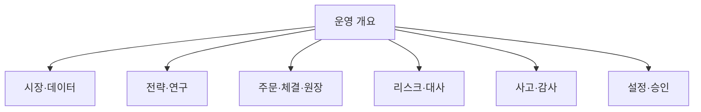

# 10. 운영 UI·UX 명세

## 1. UI의 역할

Web UI는 매매 아이디어를 화려하게 보여주는 화면보다 운영자가 “현재 안전한가, 무엇이 결정됐는가, 외부 broker와 일치하는가, 지금 어떤 조치가 필요한가”를 빠르게 답하도록 설계한다.

UI는:

- control-plane의 read model과 command API만 사용한다.
- broker API·credential에 직접 접근하지 않는다.
- `202 Accepted`를 최종 성공으로 표현하지 않는다.
- 추정/지연/paper fill과 확정/live fact를 시각적으로 구분한다.
- 모든 변경 action에 actor, reason, scope, 예상 효과와 최종 결과를 남긴다.

## 2. 정보구조

상단 global status bar는 모든 화면에 고정한다.

- environment: `LOCAL`, `PAPER`, `LIVE` — LIVE는 가장 강한 시각 신호
- market session과 데이터 freshness
- broker connection/account masked ID
- global/account kill state
- champion version과 artifact digest 축약
- 마지막 reconciliation 상태/시각
- active incident 수

## 3. 화면 명세

### 3.1 운영 개요 `/overview`

첫 화면에서 다음 질문에 답한다.

- live가 꺼져 있는가/켜져 있는가?
- feed와 broker가 정상인가?
- 현재 exposure/cash/daily PnL/drawdown은?
- UNKNOWN 주문 또는 critical mismatch가 있는가?
- champion/challenger가 어떤 상태인가?
- 오늘 필요한 사람 action은 무엇인가?

영역:

1. safety strip: environment, kill, live_enabled, incident
2. exposure cards: cash, long notional, open order committed amount
3. health timeline: feed/risk/executor/reconciliation
4. orders requiring attention
5. strategy assignments와 paper/shadow comparison
6. latest alerts와 owner/runbook

수익률 숫자는 data freshness와 valuation time을 함께 표시한다. paper 결과에 `SIMULATED EXECUTION` badge를 붙인다.

### 3.2 시장·데이터 `/market`

- universe version, symbol allow/exclusion reason
- provider connection/subscription/rate budget
- symbol별 last event/provider/ingest/available time과 age
- gap/duplicate/out-of-order/quarantine
- session/calendar/corporate action version
- raw→normalized→bar offset/lineage drill-down
- replay/backfill status와 dataset manifest

`fresh`, `delayed`, `stale`, `gap`, `quarantined`는 색+text+icon으로 표시한다.

### 3.3 전략 `/strategies`

- strategy definition/version/family/owner
- environment/account role: champion/shadow/paused/retired
- code/config/feature/universe/risk digest
- heartbeat, last decision, signal rate, risk reject, turnover
- validation summary와 report link
- AI overlay status, multiplier distribution, evidence freshness
- pause/promotion request action

전략 성과 chart는 gross/net, cost, paper/shadow/live를 분리하고 confidence interval과 regime slice를 숨기지 않는다.

### 3.4 주문·체결 `/orders`

table 필드:

- internal/client/broker ID 축약, environment/account
- instrument, side, desired/filled/remaining quantity
- state와 state age, type/price/TTL
- strategy/signal, risk decision/reasons
- attempt/fencing token, broker timestamps
- correlation ID, mismatch/incident badge

detail drawer timeline:

`market snapshot → feature → signal → AI overlay → intent → risk → submit attempt → broker ACK/fill/cancel → ledger → reconciliation`.

UNKNOWN은 단순 spinner가 아니라 “중복 방지를 위해 재제출하지 않고 broker 대사 중”이라는 설명과 다음 조회 시각을 보여준다.

### 3.5 Position·ledger `/portfolio`

- internal position과 broker position side-by-side
- quantity, avg cost, mark source/time, realized/unrealized PnL
- available/settled/committed cash
- open orders 포함 projected exposure
- lot/fill/fee/tax/correction lineage
- snapshot checksum과 마지막 reconciliation

불일치를 단일 숫자로 합쳐 숨기지 말고 internal/broker/delta를 표시한다.

### 3.6 Risk·kill switch `/risk`

- active policy version/digest/approved_by/effective time
- 각 limit observed/value/headroom/status
- 최근 reject를 rule/strategy/symbol별로 집계
- kill switch scope/reason/actor/created/expiry
- executor lease/fencing, live gate checklist
- AI clamp/invalid/fallback count

kill 생성/해제, cancel-all, reduce-only, flatten을 하나의 “emergency” 버튼으로 합치지 않는다.

### 3.7 Reconciliation `/reconciliation`

- last/full/incremental run, duration, snapshot time
- mismatch severity/type/age/owner
- internal/broker evidence, related fills/events
- resolution history와 correction ledger reference
- 수동 run action

critical mismatch가 있으면 해당 account 신규 주문 차단 여부가 바로 보여야 한다.

### 3.8 Research·promotion `/research`

- paper/hypothesis provenance와 license/retraction
- experiment lineage: code/data/config/container/search budget
- funnel gate, CV/DSR/PBO/stress/paper/shadow 결과
- all-trials view, failed run 포함
- candidate vs champion regime/cost/risk 비교
- promotion request, approver, evidence completeness, safe window, rollback target

단일 Sharpe나 종합 점수만으로 “승자”를 강조하지 않는다. PROPOSED 기준과 승인된 policy를 구분한다.

### 3.9 사고·감사 `/incidents`, `/audit`

- incident severity/status/owner/timeline/runbook
- 관련 alert/order/account/strategy/deployment
- kill/credential/policy/promotion action audit
- actor, reason, before/after digest, approval
- evidence export는 secret redaction 적용

### 3.10 설정 `/settings`

조회 우선. versioned config와 source를 보여주며 직접 자유형 편집은 피한다.

- environment/broker capability/universe
- policy/promotion config version
- service/image/schema version
- secret은 존재·expiry만 표시, 값은 표시하지 않음
- live activation은 일반 설정 toggle이 아니라 별도 gate workflow

## 4. Action UX

명령 dialog 공통:

1. 정확한 environment/account/strategy/symbol scope
2. 현재 상태와 예상 효과
3. 하지 않는 효과 명시(예: kill은 자동 청산 아님)
4. 필수 reason과 incident/ticket reference
5. idempotency key와 command ID
6. approval 필요 여부와 approver
7. `PENDING → APPLIED/FAILED/PARTIAL/UNKNOWN` 결과 추적

### 4.1 위험도별 확인

| 위험 | 예 | UX |
| --- | --- | --- |
| Low | filter, report export | 즉시 |
| Medium | paper strategy pause, replay | reason + confirm |
| High | account kill 해제, promotion apply | step-up + 명시적 summary |
| Critical | live enable, cancel-all, flatten | two-person + typed scope + 만료/rollback |

브라우저 confirm만으로 critical action을 보호하지 않는다. 서버가 권한·approval·현재 gate를 다시 검사한다.

## 5. 상태·용어

canonical label:

- environment: Local / Test / Paper / Live
- data: Fresh / Delayed / Stale / Gap / Quarantined
- order: Created / Risk rejected / Approved / Submitting / Unknown / Reconciling / Acknowledged / Partial / Filled / Cancel pending / Canceled / Manual review
- strategy: Draft / Researching / Validated / Paper / Shadow / Approval pending / Limited live / Champion / Paused / Retired
- promotion: Requested / Evidence check / Human approval / Scheduled / Applying / Verified / Rollback / Rejected

영문 canonical enum과 한국어 설명을 함께 사용하되 API enum을 UI에서 임의 변형하지 않는다.

## 6. 실시간 갱신

- browser는 control-plane SSE 또는 WebSocket read stream을 사용한다.
- 재연결 시 last event ID/cursor로 gap을 복구하고 snapshot을 재조회한다.
- UI event 유실이 trading engine state에 영향을 주지 않는다.
- stale threshold를 넘으면 마지막 값을 정상처럼 계속 표시하지 않고 age와 stale banner를 표시한다.
- tab background throttling을 고려해 focus 복귀 시 snapshot reconcile.

## 7. 접근성·반응형·국제화

- WCAG 2.2 AA 목표, keyboard-only, visible focus, semantic table
- 색에만 의존하지 않는 severity/status
- chart에 table/summary alternative와 tooltip keyboard 접근
- 숫자에 단위·통화·timezone·valuation time 명시
- 기본 UI 한국어, technical enum/ID는 복사 가능
- desktop 운영을 우선하고 1024px tablet에서 incident 대응 가능
- mobile에서는 critical action을 숨기기보다 read-only 또는 강화된 확인 정책 검토

## 8. Frontend 기술 제안

M00에서 기존 frontend를 먼저 확인한다. React/Vite가 존재하고 건강하면 유지한다.

- TypeScript strict
- generated OpenAPI client와 runtime response validation
- TanStack Query 또는 기존 검증된 server-state library
- WebSocket/SSE adapter는 reconnect/freshness/cursor를 단일 모듈에서 관리
- design token과 accessible component primitives
- chart는 시계열·drawdown·비교에 필요한 최소 library
- component/unit test + Playwright E2E
- frontend bundle에 broker secret/config 없음

새 framework 전환은 사용자 가치가 아니라 migration 비용을 만들 수 있으므로 M00 ADR 없이는 하지 않는다.

## 9. UI 완료 조건

- [ ] 모든 화면에 environment/freshness/kill 상태가 일관됨
- [ ] 한 주문의 full lineage를 3회 이하 navigation으로 확인
- [ ] UNKNOWN/mismatch/critical alert의 next action과 runbook 노출
- [ ] 202 command의 최종 상태·부분 실패 추적
- [ ] role/approval matrix와 server enforcement E2E test
- [ ] live/paper를 색 외 text/icon/layout으로 구분
- [ ] keyboard/screen-reader/contrast QA 통과
- [ ] 민감정보가 DOM, error, analytics, screenshot에 없음
- [ ] 핵심 운영 화면이 recorded E2E fixture로 검증됨
